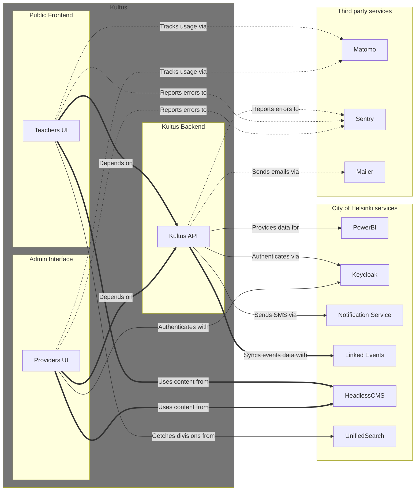

# Palvelutarjotin-admin

Providers' UI - A restricted administration client for Kultus event providers (formerly Palvelutarjotin).

<!-- START doctoc generated TOC please keep comment here to allow auto update -->
<!-- DON'T EDIT THIS SECTION, INSTEAD RE-RUN doctoc TO UPDATE -->
**Table of Contents**

- [About Kultus](#about-kultus)
- [Service architecture](#service-architecture)
  - [Environments](#environments)
  - [Frameworks and Libraries](#frameworks-and-libraries)
- [Development](#development)
  - [Getting started](#getting-started)
    - [Requirements](#requirements)
    - [About Kultus data models (and relations to LinkedEvents)](#about-kultus-data-models-and-relations-to-linkedevents)
    - [Environment configuration](#environment-configuration)
      - [Running using local Node.js](#running-using-local-nodejs)
      - [Running using Docker](#running-using-docker)
      - [Running the Kultus backend locally](#running-the-kultus-backend-locally)
      - [Running Tunnistamo](#running-tunnistamo)
  - [Husky Git Hooks](#husky-git-hooks)
    - [Pre-commit Hook](#pre-commit-hook)
    - [Commit-msg Hook](#commit-msg-hook)
- [Available Scripts](#available-scripts)
  - [`yarn dev`](#yarn-dev)
  - [`yarn test:watch`](#yarn-testwatch)
  - [`yarn test:changed`](#yarn-testchanged)
  - [`yarn test:staged`](#yarn-teststaged)
  - [`yarn test:coverage`](#yarn-testcoverage)
  - [`yarn ci`](#yarn-ci)
  - [`yarn test:debug`](#yarn-testdebug)
  - [`yarn build`](#yarn-build)
  - [`yarn codegen`](#yarn-codegen)
- [Headless CMS](#headless-cms)
  - [Headless CMS React Components -lib](#headless-cms-react-components--lib)
- [Releases, changelogs and deployments](#releases-changelogs-and-deployments)
  - [Conventional Commits](#conventional-commits)
  - [Releasable units](#releasable-units)
  - [Configuration](#configuration)
  - [Troubleshoting release-please](#troubleshoting-release-please)
    - [Fix merge conflicts by running release-please -action manually](#fix-merge-conflicts-by-running-release-please--action-manually)
  - [Deployments](#deployments)

<!-- END doctoc generated TOC please keep comment here to allow auto update -->


## About Kultus

**What is it?**
A service for teachers to find and book culture and leisure sectors activities for their student groups.

**Why is it?**
To make booking culture and leisure activities easy to all participants:
- help teachers find & enrol their student groups to activities
- help providers (culture and leisure department and partly metropolitan-area ecosystem) to show activities for teachers & their student groups
- gather data (equal possibilities and use to all groups, use of Kuva's work, resource needs etc) for service development

**Who use the service?**
- **Teacher**
  - A school or kindergarten teacher who seeks educational activities for student groups.
- **Provider**
  - A third party or a Culture and Leisure Division (i.e. [KUVA](https://www.hel.fi/fi/kulttuuri-ja-vapaa-aika)) services user who wants to provide activities for teachers & their student groups
- **Admin**
  - A user who manages the system's rights, pages etc.


## Service architecture

The Kultus service consists of:

- **[Kultus API](https://github.com/City-of-Helsinki/palvelutarjotin):** The API backend service - The primary source of data. Integrates to LinkedEvents API and extends it's features.
- **[Providers' UI](https://github.com/City-of-Helsinki/palvelutarjotin-admin):** A restricted UI where the events are maintained and published. Often called as "Admin UI".
- **[Teachers' UI](https://github.com/City-of-Helsinki/palvelutarjotin-ui):** (This service). The frontend service where the groups can view and enrol in events.
- **[Headless CMS](https://github.com/City-of-Helsinki/headless-cms):** Content Management Service that provides dynamic pages and dynamic content for the teachers' UI. It also provides content for the header and the footer. A React component library can be found from https://github.com/City-of-Helsinki/react-helsinki-headless-cms.
- **[LinkedEvents API](https://github.com/City-of-Helsinki/linkedevents):** A city of Helsinki centralized API for events.
- **[Notification Service API](https://github.com/City-of-Helsinki/notification-service-api):** A service used by the Kultus API to send SMS messages.
- **[Unified Search](https://github.com/City-of-Helsinki/unified-search):** Provide a list of divisions.
- **[Helsinki Profile (Keycloak)](https://github.com/City-of-Helsinki/open-city-profile):** Authorization service
- **Mailer:** A service used by the Kultus API to send emails.
- **PowerBI:** Data visualization.
- **[Digia Iiris](https://iirishelp.digia.com/):** Web analytics (a [Matomo](https://matomo.org/) service).
- **[Sentry](https://sentry.io/):** A monitoring service.



### Environments

Providers UI (the admin client) environments (this service):

- **Production environment:** https://kultus-admin.hel.fi/
- **Staging environment:** https://kultus-admin-ui.stage.hel.ninja/
- **Testing environment:** https://kultus-admin-ui.test.hel.ninja/

Teachers UI (the public UI) environments:

- **Production environment:** https://kultus.hel.fi/
- **Staging environment:** https://kultus-ui.stage.hel.ninja/
- **Testing environment:** https://kultus-ui.test.hel.ninja/

Kultus API environments:

- **Production environment:** https://kultus.api.hel.fi/graphql
- **Staging environment:** https://kultus.api.stage.hel.ninja/graphql
- **Testing environment:** https://kultus.api.test.hel.ninja/graphql

Headless CMS environments:

- **Production environment:** https://kultus.content.api.hel.fi/graphql
- **Testing environment:** https://kultus.app-staging.hkih.hion.dev/graphql

LinkedEvents

- **Production environment:** https://api.hel.fi/linkedevents/v1/
- **Testing environment:** https://linkedevents.api.test.hel.ninja/v1/

Notification service

- **Production environment:** https://kuva-notification-service.api.hel.fi/v1/
- **Testing environment:** https://kuva-notification-service.api.stage.hel.ninja/v1/

Unified Search

- **Production environment:** https://kuva-unified-search.api.hel.fi/search
- **Testing environment:** https://kuva-unified-search.api.stage.hel.ninja/search


### Frameworks and Libraries

This project is built using the following key frameworks and libraries:

- **[Vite](https://vite.dev/):** A modern frontend build tool that provides a fast and efficient development experience. It offers features like instant server start, hot module replacement, and optimized builds.
- **[React](https://react.dev/):** A JavaScript library for building user interfaces. It allows for the creation of reusable UI components and efficient management of application state.
- **[Apollo](https://www.apollographql.com/docs/react):** Apollo Client is a comprehensive state management library for JavaScript. It enables you to manage both local and remote data with GraphQL.
- **[Helsinki Design System](https://hds.hel.fi/):** The central digital experience resource of Helsinki Design Language. Guidelines, design assets and component libraries for building a consistent and accessible digital brand across the city.
- **[React Helsinki Headless CMS -library](https://github.com/City-of-Helsinki/react-helsinki-headless-cms/):** React Helsinki Headless CMS - is a highly customized component library based on HDS. It is designed for Helsinki City Web applications which are using preconfigured Wordpress Headless CMS environments (compatible with the library). This library is a set of unified visual components.


## Development

### Getting started

1. Clone this repository
2. If you're new to multiple `.env*` files, read Next.js's [Environment Variable Load Order](https://nextjs.org/docs/pages/building-your-application/configuring/environment-variables#environment-variable-load-order)
3. If you're new to multiple Docker compose files, read Docker's [Merge Compose Files](https://docs.docker.com/compose/how-tos/multiple-compose-files/merge/)
4. Follow the instructions below for your preferred way of running this app:
   - [Running using local Node.js](#running-using-local-nodejs) **or**
   - [Running using Docker & Docker compose](#running-using-docker)

#### Requirements

Compatibility defined by [Dockerfile](./Dockerfile):

- Docker
- Node.js 20.x
- Yarn

#### About Kultus data models (and relations to LinkedEvents)

> IMPORTANT: The event data is partially stored in LinkedEvents and partially in Kultus API. Because of that, Kultus API and LinkedEvents API databases needs to be in sync so they can successfully share and fullfill each other's event data. This means that if you run a local Kultus API, you will also need a local LinkedEvents, or otherwise one of the APIs have event data that cannot be fully fullfilled, which leads to missing events.

**Kultus API extends the LinkedEvents event data by providing (one or more) occurrence times for a single event.** When users are enrolling, they are actually enrolling to the event occurrences, not the event itself. The event is like an container to multiple occurrences.

There are multiple types of events:

- **Enrolments can be managed differently**:
  1. Events that are public and does not need any enrolling.
  2. Events that have internal enrolments when the enrolment is done from the Kultus (from Teacher's UI) itself.
  3. Events that have external enrolments. Then Kultus does not know the enrolment status and cannot do any management to them.

- **Enrolments can be automatically or manually approved.** IF the enrolments are approved automatically, the approval is given immediately after the enrolment is sent and the event still had enough space left for the study group that enrolled. If the enrolments are approved manually, the enrolments are managed by the event admins or providers through the Provider's UI.

- **Multiple occurrences might be needed**. When an event is created (in Kultus Provider's UI), the admin can choose whether an enrolment needs multiple occurrences to be chosen. In such events, the registrant must commit to attending the event on multiple event dates. These enrolments are always handled in Kultus internally and are automatically approved.

- **Enrolments queue** might also be enabled, which means that when an occurrence is fully booked, the study groups can enrol to queue. IF any enrolment cancellations are made or the enrolments are reorganizing by the admins, enrolments in queue can be promoted to the group of actual registrations.

#### Environment configuration

> Please read the [About Kultus data models (and relations to LinkedEvents)](#about-kultus-data-models-and-relations-to-linkedevents) before choosing and configuring the environment to understand how fragmented the data is and how does it affect in Kultus when another environmetn is chosen.

The public [test (and development environments)](#environments) can be used to run this app, but sometimes it might be, that all the new features of the API are yet to be published to the public environment. Then you may need also a local Kultus API running in your own local machine.

1. Select the used API:
    1. **When running with a public API**, you will need only the UI running locally (in a Docker container or with a local Node).
    2. **When running a fully local environment**, you will need
        - a local Kultus API (running with a local Python or in a Docker container)
        - a local LinkedEvents (running with a local Python or in a Docker container, but a dockerized environment is highly recommended).

2. **The OIDC clients needs to be configured** so that
    - the UI client and the API are using the same the authorization server, meaning that the API can validate and verify the JWT issuer.
    - the UI's and the API's OIDC client names are set so that the authorization server the JWT's authorized party and audience matches the client names.

3. **Configure LinkedEvents**: The UI client needs to be configured to use the same LinkedEvents as the API is using or otherwise the links to the events will not work properly, since part of the event data would be missing (see [About Kultus data models (and relations to LinkedEvents](#about-kultus-data-models-and-relations-to-linkedevents)).


##### Running using local Node.js

Using the following instructions you should be able to:

- Run this UI using local Node.js
- Run the Kultus API backend locally in Docker or use the public test environment's backend
- Use the public test environments of Helsinki Profile and Keycloak for authentication

TODO: steps - set environment variables, launch node server...

##### Running using Docker

Using the following instructions you should be able to:

- Run this UI using Docker & Docker compose
- Run the Kultus backend locally in Docker or use the public test environment's backend

TODO: steps - set environment variables, launch docker services...

##### Running the Kultus backend locally

If you want to run the Kultus backend locally:

- Clone the [Kultus API -repo](https://github.com/City-of-Helsinki/palvelutarjotin)
- Follow its README to run it locally in Docker
- After this the Kultus API should be running at http://localhost:8081/graphql (i.e. the value of `NEXT_PUBLIC_API_BASE_URL`)
- Since the Kultus API is runing locally, also the LinkedEvents must be ran locally, or otherwise the date related to events is not in sync with LinkedEvents and only partial event data is available, leading to missing events.

TODO: steps - set environment variables, launch backend service...


##### Running Tunnistamo

See [Setup local Tunnistamo](./docs/tunnistamo.md).

### Husky Git Hooks

This project uses [Husky](https://typicode.github.io/husky/#/) to manage Git hooks. Husky is configured to run specific scripts before committing changes to ensure code quality and consistency.

#### Pre-commit Hook

The pre-commit hook is configured to run the following commands:

```sh
yarn doctoc .
yarn lint-staged --relative
```

- `yarn doctoc .`: This command updates the table of contents in your markdown files.
- `yarn lint-staged --relative`: This command runs linting on staged files to ensure they meet the project's coding standards. The lint-staged configuration can be found from [lint-staged.config.js](./lint-staged.config.js).
  - Using `--relative` flag to reduce command line length,
    as the combined length of all the absolute paths for a large commit can get quite long

> NOTE: `doctoc` and `husky` does not work seamlessly together, since the `doctoc` does update the TOCs of the markdown files, but does not reject the pre-commit hook execution, and only leaves the refactored files as unstaged in Git.

#### Commit-msg Hook

The commit-msg hook is configured to run the following command:

```sh
npx --no-install commitlint --edit "$1"
```

- `npx --no-install commitlint --edit "$1"`: This command uses [Commitlint](https://commitlint.js.org/#/) to lint commit messages based on the project's commit message conventions. This repo follows the [Conventional Commits](#conventional-commits).


## Available Scripts

In the project directory, you can run:

### `yarn dev`

Runs the app in the development mode.<br />
Open http://localhost:3000/ to view it in the browser.

The page will reload if you make edits.<br />
You will also see any lint errors in the console.

### `yarn test:watch`

Runs the tests and watches for changes in interactive watch mode.<br />
See the section about [running tests](https://facebook.github.io/create-react-app/docs/running-tests) for more
information.

### `yarn test:changed`

Run tests against uncommitted changes (including staged and unstaged).

### `yarn test:staged`

Run tests against staged changes, used in husky git commit hook.

### `yarn test:coverage`

Run tests and generate coverage report

### `yarn ci`

Run tests and generate coverage report, meant for Continuous Integration (CI) pipeline use.

### `yarn test:debug`

Debug tests

### `yarn build`

Builds the app for production to the `build` folder.<br />
It correctly bundles React in production mode and optimizes the build for the best performance.

The build is minified and the filenames include the hashes.<br />
Your app is ready to be deployed!

See the section about [deployment](https://facebook.github.io/create-react-app/docs/deployment) for more information.

### `yarn codegen`

Codegen settings in <b>codegen.yml</b>

- Generate static types for GraphQL queries by using the schema from the backend server. url to backend server is
  defined to VITE_APP_API_URI in .env.development.local
- Generate react hooks for GraphQL queries from <b>query.ts</b> and <b>mutation.ts</b> files.


## Headless CMS

A headless CMS system is used to produce some dynamic pages, but also the header and the footer contents for the UI (layout). The Headless CMS server endpoint is set with `NEXT_PUBLIC_CMS_BASE_URL` environment variable.

The default server that is used is the test / staging server:

```
NEXT_PUBLIC_CMS_BASE_URL="https://kultus.app-staging.hkih.hion.dev/graphql"
```

See the available servers from [Environments](#environments).

To login to the Wordpress admin UI, use

- `/wp/wp-admin/` -endpoint, if the credentials you are using are Entra ID -credentials
- `/wp-login.php` -endpoint, if the credentials you are using are not Entra ID -credentials.

### Headless CMS React Components -lib

> Git repository: https://github.com/City-of-Helsinki/react-helsinki-headless-cms/

The React Helsinki Headless CMS is a React component library developed by the City of Helsinki to facilitate the creation of web applications that interact with a headless WordPress CMS. This library provides a suite of pre-built components and utilities designed to streamline the development process and ensure consistency across various applications.

The architecture of the React Helsinki Headless CMS is modular and designed for flexibility:

- Component-Based Structure: The library is organized into reusable React components, each responsible for a specific piece of functionality or UI element. This modularity allows developers to compose applications efficiently by assembling these components as needed.
- Integration with Headless CMS: The library is tailored to work seamlessly with headless WordPress CMS environments. It relies on GraphQL schemas to fetch and present content, making it heavily dependent on the structure and features of the connected WordPress instance.
- Apollo Client Integration: For data management, the library utilizes Apollo Client to handle GraphQL queries and mutations. Developers are expected to provide an Apollo client linked to a GraphQL endpoint with a supported schema (headless CMS) in the apolloClient field of the configuration object.

## Releases, changelogs and deployments

The used environments are listed in [Service environments](#service-environments).

The application uses automatic semantic versions and is released using [Release Please](https://github.com/googleapis/release-please).

> Release Please is a GitHub Action that automates releases for you. It will create a GitHub release and a GitHub Pull Request with a changelog based on conventional commits.

Each time you merge a "normal" pull request, the release-please-action will create or update a "Release PR" with the changelog and the version bump related to the changes (they're named like `release-please--branches--master--components--palvelutarjotin-admin`).

To create a new release for an app, this release PR is merged, which creates a new release with release notes and a new tag. This tag will be picked by Azure pipeline and trigger a new deployment to staging. From there, the release needs to be manually released to production.

When merging release PRs, make sure to use the "Rebase and merge" (or "Squash and merge") option, so that Github doesn't create a merge commit. All the commits must follow the conventional commits format. This is important, because the release-please-action does not work correctly with merge commits (there's an open issue you can track: [Chronological commit sorting means that merged PRs can be ignored ](https://github.com/googleapis/release-please/issues/1533)).

See [Release Please Implementation Design](https://github.com/googleapis/release-please/blob/main/docs/design.md) for more details.

And all docs are available here: [release-please docs](https://github.com/googleapis/release-please/tree/main/docs).

### Conventional Commits

Use [Conventional Commits](https://www.conventionalcommits.org/) to ensure that the changelogs are generated correctly.

### Releasable units

Release please goes through commits and tries to find "releasable units" using commit messages as guidance - it will then add these units to their respective release PR's and figures out the version number from the types: `fix` for patch, `feat` for minor, `feat!` for major. None of the other types will be included in the changelog. So, you can use for example `chore` or `refactor` to do work that does not need to be included in the changelog and won't bump the version.

### Configuration

The release-please workflow is located in the [release-please.yml](./.github/workflows/release-please.yml) file.

The configuration for release-please is located in the [release-please-config.json](./release-please-config.json) file.
See all the options here: [release-please docs](https://github.com/googleapis/release-please/blob/main/docs/manifest-releaser.md).

The manifest file is located in the [release-please-manifest.json](./.release-please-manifest.json) file.

When adding a new app, add it to both the [release-please-config.json](./release-please-config.json) and [release-please-manifest.json](./.release-please-manifest.json) file with the current version of the app. After this, release-please will keep track of versions with [release-please-manifest.json](./.release-please-manifest.json).

### Troubleshoting release-please

If you were expecting a new release PR to be created or old one to be updated, but nothing happened, there's probably one of the older release PR's in pending state or action didn't run.

1. Check if the release action ran for the last merge to main. If it didn't, run the action manually with a label.
2. Check if there's any open release PR. If there is, the work is now included on this one (this is the normal scenario).
3. If you do not see any open release PR related to the work, check if any of the closed PR's are labeled with `autorelease: pending` - ie. someone might have closed a release PR manually. Change the closed PR's label to `autorelease: tagged`. Then go and re-run the last merge workflow to trigger the release action - a new release PR should now appear.
4. Finally check the output of the release action. Sometimes the bot can't parse the commit message and there is a notification about this in the action log. If this happens, it won't include the work in the commit either. You can fix this by changing the commit message to follow the [Conventional Commits](https://www.conventionalcommits.org/) format and rerun the action.

**Important!** If you have closed a release PR manually, you need to change the label of closed release PR to `autorelease: tagged`. Otherwise, the release action will not create a new release PR.

**Important!** Extra label will force release-please to re-generate PR's. This is done when action is run manually with prlabel -option

Sometimes there might be a merge conflict in release PR - this should resolve itself on the next push to main. It is possible run release-please action manually with label, it should recreate the PR's. You can also resolve it manually, by updating the [release-please-manifest.json](./.release-please-manifest.json) file.

#### Fix merge conflicts by running release-please -action manually

1. Open [release-please github action](https://github.com/City-of-Helsinki/palvelutarjotin-admin/actions/workflows/release-please.yml)
2. Click **Run workflow**
3. Check Branch is **master**
4. Leave label field empty. New label is not needed to fix merge issues
5. Click **Run workflow** -button

There's also a CLI for debugging and manually running releases available for release-please: [release-please-cli](https://github.com/googleapis/release-please/blob/main/docs/cli.md)

### Deployments

When a Release-Please pull request is merged and a version tag is created (or a proper tag name for a commit is manually created), this tag will be picked by Azure pipeline, which then triggers a new deployment to staging. From there, the deployment needs to be manually approved to allow it to proceed to the production environment.

The tag name is defined in the [azure-pipelines-release.yml](./azure-pipelines-release.yml).